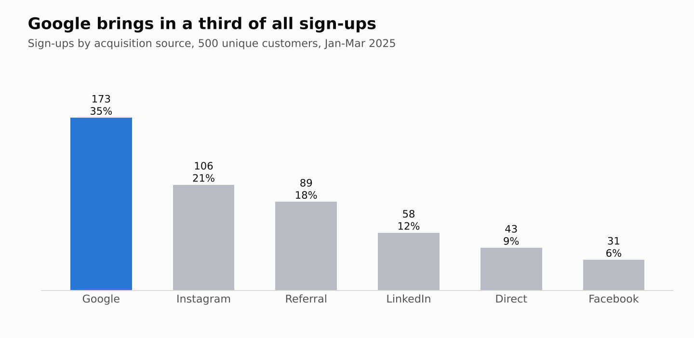
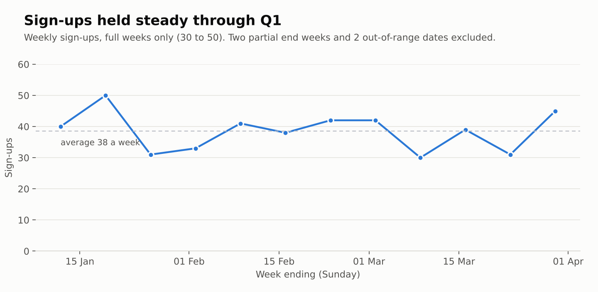
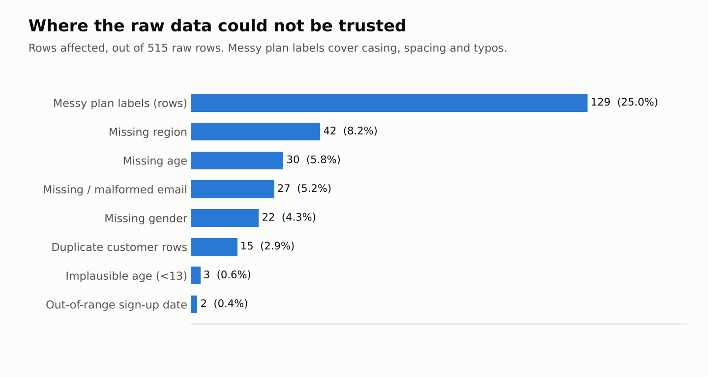
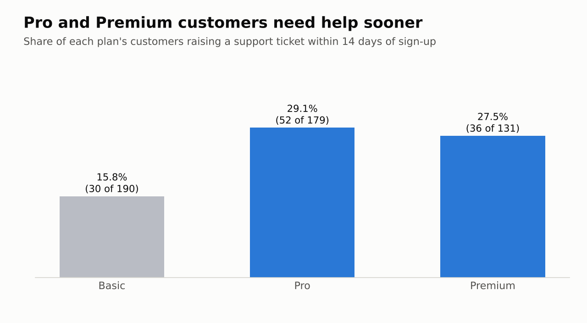
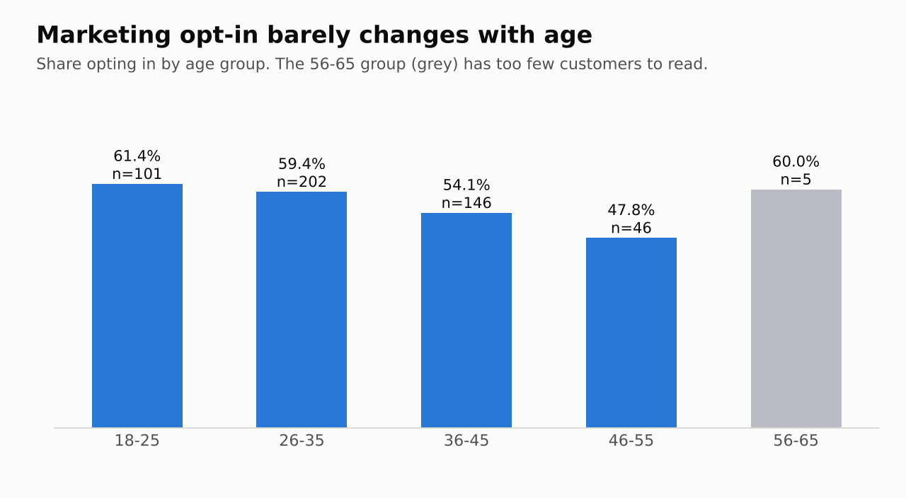

# Customer Sign-Up Behaviour & Data Quality Audit

   

An end-to-end data quality audit and acquisition analysis of a SaaS customer sign-up dataset, built in Python and pandas as part of my CompTIA Data+ coursework.

The brief: act as a new BI analyst supporting a Monthly Business Review. Find out where the data can't be trusted, fix it with documented reasoning, then tell Marketing and Onboarding what the clean data says about how customers sign up, which plans they choose, and who needs help early.

---

## Headline findings

| # | Finding | Evidence |
|---|---------|----------|
| 1 | **Google is the largest acquisition channel**, at roughly 1.6x the next source | 173 of 500 customers (34.6%) vs Instagram 106, Referral 89 |
| 2 | **Google also led in the most recent full month (March 2025)** | 49 sign-ups vs Instagram 38, Referral 31 |
| 3 | **Region is the biggest data gap** | 42 of 515 raw rows (8.2%) had no region |
| 4 | **Pro and Premium customers contact support early far more than Basic** | Within 14 days of sign-up: Pro 29.1%, Premium 27.5%, Basic 15.8% |
| 5 | **Younger customers opt in to marketing slightly more** | 61.4% (18-25) falling to 47.8% (46-55). Directional only, see limitations |
| 6 | **Gender is not a useful lever for opt-in** | 55.0% to 59.0% opt-in across every gender group |
| 7 | **Basic is the most popular plan overall**, Pro leads in the 26-35 group | Basic 190, Pro 179, Premium 131 |

Weekly sign-ups were stable across Q1 2025, running at 30-50 per full week with no sustained trend.

<p align="center">
  
</p>

<p align="center">
  
</p>

---

## Data

Two CSV files supplied with the course brief (**not included in this repository**, because they contain personal fields such as names and emails):

**`customer_signups.csv`** (515 rows, 10 columns)

| Column | Description |
|--------|-------------|
| `customer_id` | Unique identifier, used as the de-duplication key |
| `name`, `email` | Customer contact details (email contains missing and malformed values) |
| `signup_date` | Sign-up date (contains out-of-range values) |
| `source` | Acquisition channel: Google, Instagram, Referral, LinkedIn, Direct, Facebook |
| `region` | North, South, East, West, Central (contains missing values) |
| `plan_selected` | Basic / Pro / Premium (inconsistent casing, spelling, whitespace) |
| `marketing_opt_in` | Yes / No |
| `age` | Numeric (contains nulls and implausible values) |
| `gender` | Inconsistent labels and missing values |

**`support_tickets.csv`** (234 rows, 6 columns): `ticket_id`, `customer_id`, `ticket_date`, `category`, `status`, `resolution_days`

---

## Data quality audit

Every issue found, ranked by how likely it is to mislead a business decision if left uncorrected. Counts are on the 515 raw rows.

<p align="center">
  
</p>

| Severity | Issue | Scale | Business impact |
|----------|-------|-------|-----------------|
| **High** | Duplicate `customer_id` rows | 15 rows (2.9%) | Inflates sign-up counts and double-counts customers |
| **High** | Missing `region` | 42 rows (8.2%) | Regional campaign reporting undercounts or misattributes sign-ups |
| **High** | Inconsistent `plan_selected` values | 15 raw variants to 3 (129 rows, 25.0%) | "Most popular plan" fragments across buckets and becomes unreliable |
| **Medium** | Missing `age` | 30 rows (5.8%) | Shrinks the sample for age-based segmentation |
| **Medium** | Missing or malformed `email` | 27 rows (5.2%): 26 missing + 1 malformed | Customers unreachable by email onboarding or marketing |
| **Medium** | Inconsistent `gender` values | 15 raw variants to 3 | Opt-in-by-gender analysis splits across buckets |
| **Low** | Missing `gender` | 22 rows (4.3%) | Slightly understates demographic breakdowns |
| **Low** | Implausible `age` (under 13) | 3 raw rows (2 remain after de-duplication) | Distorts min/mean age if left in |
| **Low** | Out-of-range `signup_date` (Aug 2026, vs Jan-Mar 2025 for all other rows) | 2 rows | Creates a false 18-month tail in trend charts and **breaks "last month" logic** |

---

## Cleaning decisions

Each rule was chosen deliberately, not applied by default.

| Problem | Decision | Why |
|---------|----------|-----|
| Duplicates | Sort by `signup_date`, keep the most recent row per `customer_id` | Defensible rule; 515 to 500 rows. One customer (CUST0449) had conflicting ages (7 vs 28), and the tie was resolved by row order, which I verified rather than assumed |
| `plan_selected` | Strip whitespace, lowercase, map known typos through a dictionary (`basci`, `proe`, `premum`), fall back to title case | Collapses 15 variants to Basic / Pro / Premium |
| `gender` | Same approach; `m`/`man`/`male` to Male, `f`/`woman`/`female` to Female, `nb`/`non-binary`/`other` to Other. Missing values preserved as true `NaN` during cleaning, then labelled **Unknown** | Keeps "did not answer" separate from "answered Other" |
| Missing `region` | Labelled **Unknown**, rows kept | Region cannot be inferred from other columns, and guessing would mislead regional reports. Dropping would discard otherwise usable rows |
| Missing / malformed `email` | Validated with a regex; invalid values set to missing, rows kept | Contact details cannot be fabricated, but the rest of the row is still valid |
| Implausible age (under 13) | Set to missing **before** imputation | Stops bad values dragging down the median |
| Missing age | Filled with the median (33.5) | Robust to outliers. Trade-off: it creates a visible spike at ~33 in the age histogram |
| Out-of-range dates | Flagged and excluded **only from time-based analysis** | The rows are still valid for plan, region and source analysis |

---

## Method

1. **Load and profile**: shape, dtypes, `isnull().sum()`, `.unique()` on every categorical column, `.describe()` on age
2. **Audit**: duplicates, missing values, inconsistent labels, implausible values, wrong data types
3. **Clean**: documented rules above; cleaned file saved to `customer_signups_clean.csv`
4. **Analyse**: `value_counts`, `crosstab` (with row-normalised percentages so group sizes don't distort comparisons), weekly `resample`
5. **Visualise**: weekly sign-up trend, sign-ups by source, plan distribution, age histogram
6. **Join (stretch task)**: merge support tickets onto sign-ups by `customer_id`, compute `days_to_ticket`, and report the share of each plan's customers contacting support within 14 days

<p align="center">
  
</p>

<p align="center">
  
</p>

---

## Repository contents

| File | Purpose |
|------|---------|
| [`images/`](images) | The five charts shown in this README |
| [`Signup_Audit.ipynb`](Signup_Audit.ipynb) | Full analysis notebook: cleaning, audit table, aggregations, charts, business questions |
| [`Customer_Signup_Audit_Report00.pdf`](Customer_Signup_Audit_Report00.pdf) | Plain-language stakeholder report for a non-technical audience |
| [`Signup_Audit Notebook_Code_Export.pdf`](Signup_Audit%20Notebook_Code_Export.pdf) | PDF export of the notebook, viewable without Jupyter |

---

## Run it yourself

```bash
pip install pandas numpy matplotlib jupyter
jupyter notebook Signup_Audit.ipynb
```

Place `customer_signups.csv` and `support_tickets.csv` in the same folder as the notebook and update the filename in the first `read_csv` call if yours differs. Run cells top to bottom (or **Kernel > Restart & Run All**). Several cleaning cells overwrite columns in place, so running them out of order or twice will give wrong results.

---

## Limitations and assumptions

- **Single quarter of data.** Almost all sign-ups fall in Jan-Mar 2025, so no seasonality can be assessed. "Last month" is defined as March 2025, the latest month after removing the two out-of-range dates.
- **No significance testing.** The opt-in differences by age and gender are descriptive. The 56-65 age group has only 5 customers, so its 60% opt-in rate is not meaningful.
- **Imputation has a cost.** Median age fill is a pragmatic choice, but it adds a spike near 33 and slightly understates real age variation.
- **Support analysis is correlational.** Pro and Premium customers raising more early tickets is consistent with more complex onboarding, but the data cannot prove cause. Five tickets referenced customer IDs absent from the sign-ups file and were dropped by the inner join.
- **The first and last calendar weeks are partial.** The data runs from Wed 1 Jan to Mon 31 Mar 2025, so those two weeks contain only 5 and 1 days of sign-ups. The weekly chart shows full weeks only; leaving them in produces a false drop at the right edge.
- **The two out-of-range dates are assumed to be entry errors** (likely a mistyped year). That should be confirmed with the data owner before the rows are corrected rather than just excluded.

---

## Recommendations

1. **Keep investing in Google** while testing whether its approach transfers to Instagram and Referral, the next two channels.
2. **Add a structured first-two-weeks onboarding flow for Pro and Premium**, where early support demand is roughly 1.8x Basic.
3. **Make `region` a required field at sign-up**, or derive it from billing data, so regional reporting stops carrying an 8% "Unknown" bucket.
4. **Add input validation at the source** (dropdowns for plan and gender, date range checks, email format checks). Most issues in this audit would never have reached the dataset.

---

## About this project

Built as CompTIA Data+ coursework. I used Claude as a tutor and for drafting the stakeholder report. I typed, ran and debugged the notebook myself, including the execution-order and missing-value bugs documented in my cleaning notes.

**Author:** Raphael Ehis Akhigbe
[GitHub](https://github.com/raphaelakhigbe?tab=repositories) · [LinkedIn](https://www.linkedin.com/in/raphael-akhigbe-eointrade/)
